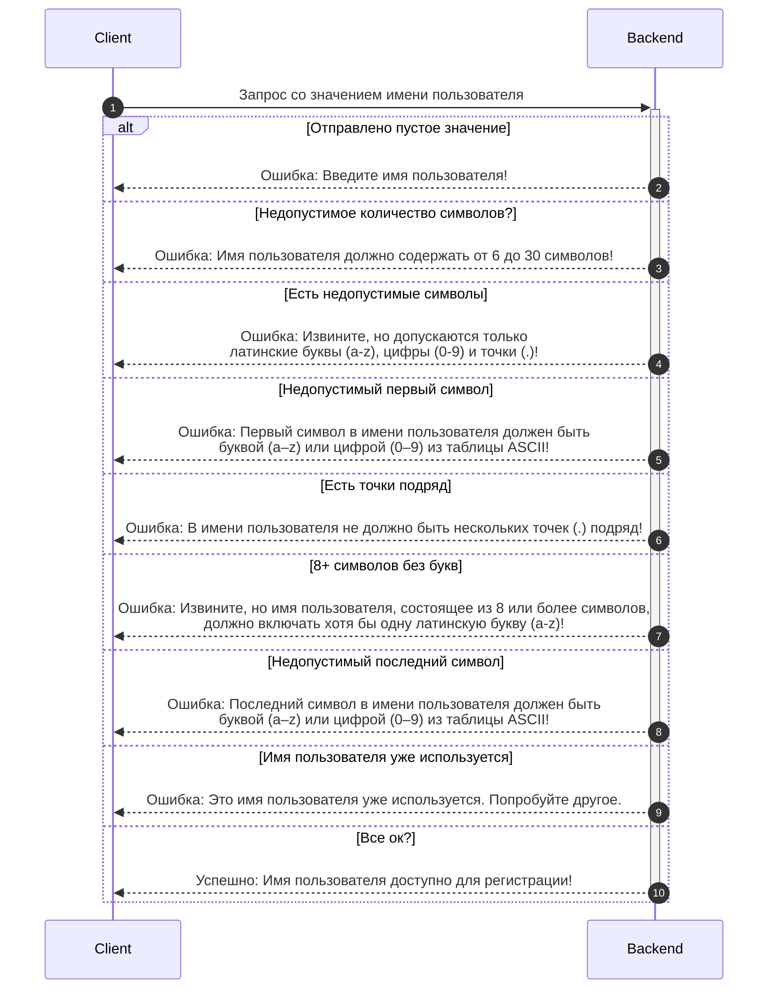

# Демонстрационный проект тестирования API.
### Описание:
API проверяет доступность имени пользователя для регистрации. API принимает единственный аргумент с именем пользователя и возвращает сообщение с результатом.

### Сборка и запуск в Docker из root-каталога проекта:

	docker build -t simple_api_img -f app/Dockerfile .
	docker build -t tests_for_simple_api_img -f tests/Dockerfile .
  
	docker run -it -p 5000:5000 --name simple_api_cont simple_api_img
	docker run -it --link simple_api_cont:simple_api_app --name tests_for_simple_api_cont tests_for_simple_api_img

